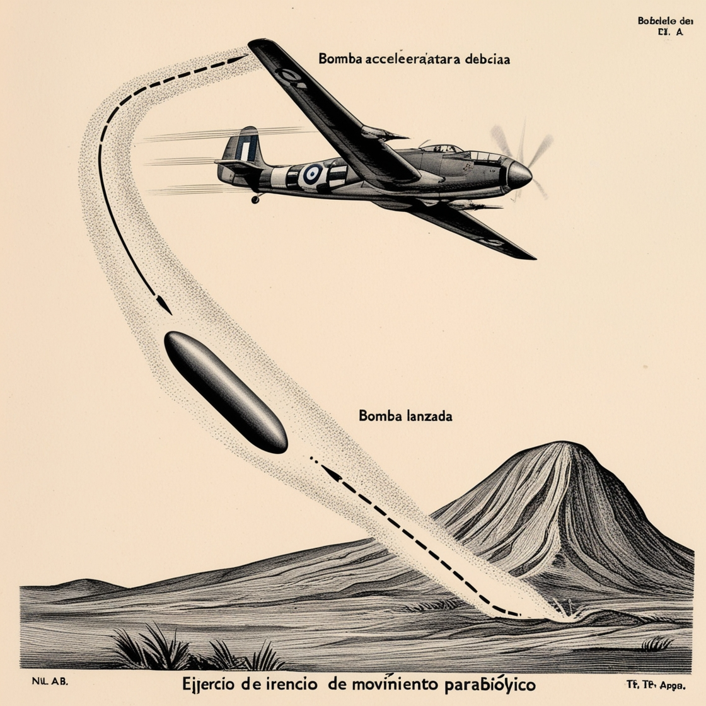

# Proyecto de Métodos Numéricos ✈️💣

## Integrantes:
- Andino Jose
- Paillacho Kevin
- Perez Luis
- Simbaña Fabian

## Descripción 📜

Un avión vuela con velocidad $V$ a $H_a$ metros sobre el nivel del mar en dirección a una montaña. 

La montaña tiene forma de triángulo isósceles, con una altura $H_m$ y un ángulo $\alpha$ con respecto al horizonte.

Cuando se encuentra a una distancia $d$ del pico de la montaña, el avión suelta una bomba.

## Objetivo 🎯
* Grafique la trayectoria de la bomba y el punto de impacto.

## Código en Google Colab 💻

Puedes acceder al código del proyecto en Google Colab mediante el siguiente enlace:

[Acceder al código en Colab](https://colab.research.google.com/drive/1w75m-0CG3L6UNllu3PwklSzzWogN5W-w)

### Descripción del código
El código en Colab implementa métodos numéricos para calcular y graficar la trayectoria de la bomba lanzada desde el avión. Utiliza la ecuación de movimiento parabólico considerando la resistencia del aire y otros factores relevantes para simular con precisión el punto de impacto. Incluye la visualización de la trayectoria en un gráfico y analiza diferentes parámetros para predecir el comportamiento de la bomba.

## Presentación en Canva 📊

Para ver la presentación detallada del proyecto, puedes acceder al diseño en Canva a través del siguiente enlace:

[Ver la presentación en Canva](https://www.canva.com/design/DAGIb4Ia-_E/Ak2r5KRLeGcVjXACB1plnw/edit?utm_content=DAGIb4Ia-_E&utm_campaign=designshare&utm_medium=link2&utm_source=sharebutton)

## Video de presentación 🎥

Puedes ver el video de presentación del proyecto mediante el siguiente enlace:

